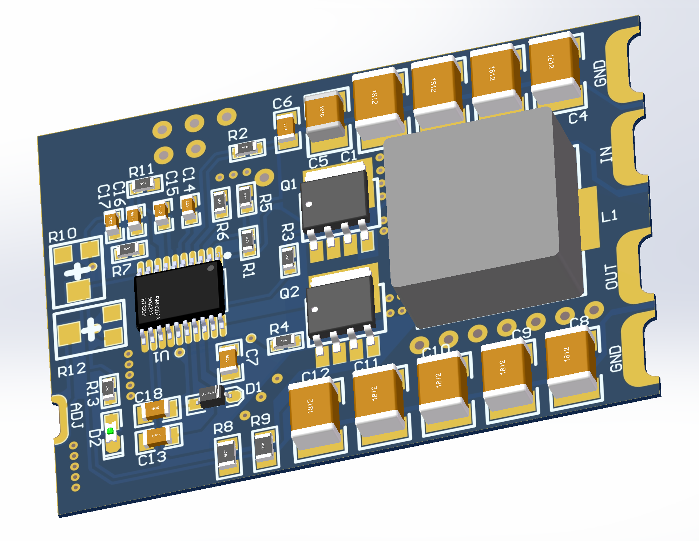

# PCB-Mounted-Programmable-DC-Power-Supply

> **LM5116板载DC-DC程控电源**

开源硬件项目：基于LM5116的板载程控电源，PCB半孔设计，负载电流达10A，可以用于驱动直流大功率电器。

基本参数
+ 输入：28V直流稳压输入
+ 输出：2-25V直流稳压输出，最大负载电流10A
+ 体积：4.5×3.2×0.6cm
+ 耐压：±50V
+ 安装方式：PCB板载
+ 设计特点：模块化紧凑设计、器件0603封装、PCB半孔工艺
